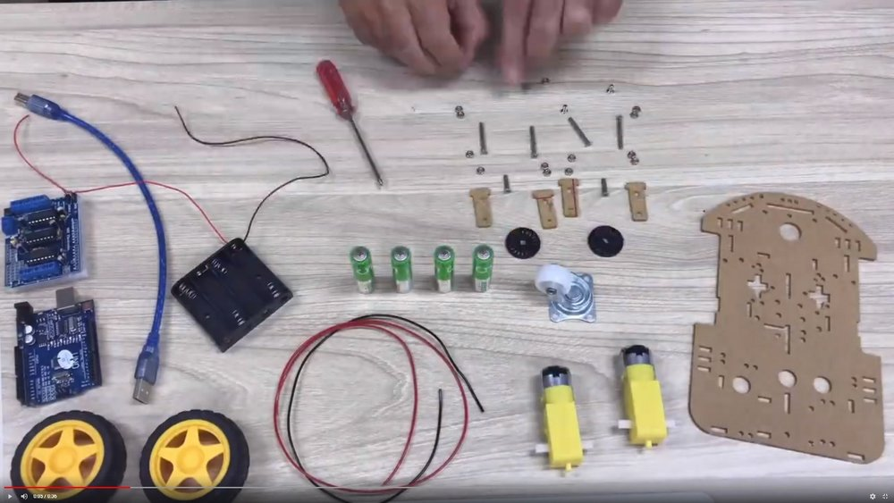

# T110 Robot with Bluetooth 4.0

## 2019-03-30 Update

I could not find a software using plain Bluetooth 4.0 with iOS devices. But there is a good BLE (Bluetooth Low Energy) controller from DFRobot out there. The communication is a little more complicated than the plain strait forward Serial interface with just 2 defined pins for RX and TX and the connection speed, but I made it work: [Project ESP32](../ESP32).

## 2019-10-25 Findings as documented in the Wiki

After a few days I discovered several challenges with the hardware: I bought the AT-09 module [Mạch thu phát Bluetooth 4.0 UART CC2541 AT-09](https://icdayroi.com/mach-thu-phat-bluetooth-4-0-uart-cc2541-at-09) from https://icdayroi.com/. Connecting it with the serial port and processing the "AT+VERSION" command reveals the model number "jdy-09-v4.3". Some websites state that this is a cheap clone of the HM-10, which itself is only a clone of the AT-09. Differences are seen in the available functions (AT+HELP) and that the producer Bolutek is removed from the firmware. Chip is probably CC2541. Not the firmware of the BT-05A. No iBeacon support.

Some programming is described at [medium.com](https://medium.com/@yostane/using-the-at-09-ble-module-with-the-arduino-3bc7d5cb0ac2). Connection to iPhone with [LightBlue Explorer](https://itunes.apple.com/us/app/lightblue-explorer/id557428110?mt=8) or [BLE Scanner](https://itunes.apple.com/us/app/ble-scanner-4-0/id1221763603?mt=8) works, but I didn't found a robot control software for free or serial terminal. Still looking ... mBot is hard to find the protocol.

As for the firmware of our bluetooth module: It might be possible to flash the original HM-10 firmware. It's tricky using and Arduino or it requires additional hardware. Software is available at http://www.jnhuamao.cn/download_rom_en.asp?id=66# - but several post indicate this site contains adware, spyware and the like.

## 2018-10-03 Initial thoughts

Arduino robot with Bluetooth 4.0 control

Since iOS only supports Bluetooth from 4.0 on and the HC-05 module is Bluetooth 2.0 we needed to upgrade our first model T-100 with a different Bluetooth module: Now we use AT-09. Then we can use our iPhones to control it!

I uploaded [a timelapse video](https://youtu.be/CzpAYpl62GI) about the creation of this robot in 30 seconds. It actually took 2 hours.

Old video: How to build a robot in 30 seconds: https://www.youtube.com/watch?v=4jvJJgrxoKo.

More details in the [Wiki](https://github.com/kreier/T110/wiki). 

